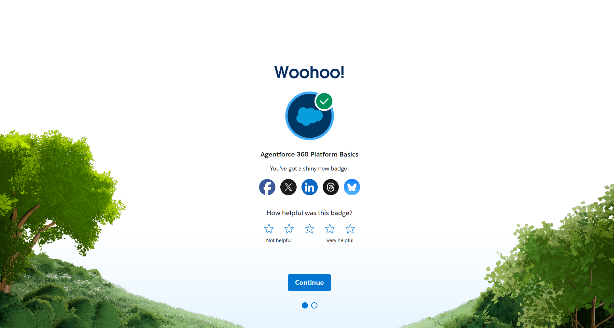
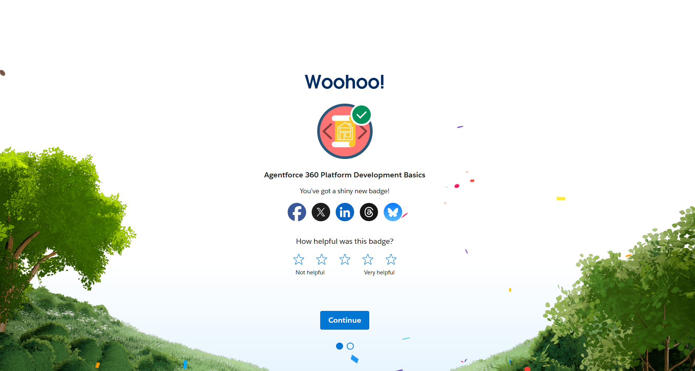

# Day 2 - Salesforce Platform Basics

## 1. What is Salesforce Platform?

Salesforce Platform is a cloud-based platform that helps businesses build applications, automate workflows, manage customer data, and improve productivity using low-code and no-code tools. It allows developers and administrators to create custom apps, objects, automations, and integrations according to business needs.

The platform supports:
- App development
- Workflow automation
- AI features
- Data management
- Reports and dashboards
- API integrations

Salesforce is widely used in Sales, HR, Customer Service, IT, and many other departments.

---

# 2. Explain the Following

## App
An App in Salesforce is a collection of tools, tabs, objects, and features grouped together for a specific business purpose.

### Example:
- Sales App
- Service App
- HR App

Apps help users access all related functionality from one place.

---

## Object
An Object in Salesforce is like a database table used to store information.

Objects contain records and fields.

### Standard Objects:
- Account
- Contact
- Lead

### Custom Objects:
- Property
- Employee
- Job Application

Example:
A Property object may contain:
- Property Name
- Price
- Address
- Bedrooms

---

## Tab
A Tab is used to access objects, apps, dashboards, reports, or other Salesforce features through the user interface.

Tabs make navigation easier for users.

### Example:
- Contacts Tab
- Accounts Tab
- Property Tab

---

# 3. Difference Between Configuration and Coding

| Configuration | Coding |
|---|---|
| Uses low-code or no-code tools | Uses programming languages |
| Easier and faster | More flexible but complex |
| Done using clicks and setup menus | Done by writing code |
| Used for workflows, objects, validation rules | Used for advanced logic and customization |
| Example: Flow Builder | Example: Apex and Lightning Web Components |

---

# 4. My System Design

## System Name:
Student Placement Management System

## App:
Placement Management App

## Objects:
### Standard Objects
- Contact
- Task

### Custom Objects
- Student
- Company
- Interview
- Job Application

---

## User Interaction Flow

1. Students register their details.
2. Companies add job openings.
3. Placement officers schedule interviews.
4. Interview results are updated.
5. Students receive updates and notifications.
6. Reports are generated to track placements.

---

# 5. Screenshots from Trailhead

## Agentforce 360 Platform Basics Badge

---

## Agentforce 360 Platform Development Basics Badge

---

# Conclusion

Through this module, I learned:
- Salesforce Platform basics
- Apps, Objects, and Tabs
- Metadata and APIs
- Configuration vs Coding
- How Salesforce can be customized for business needs

The Salesforce platform helps organizations automate processes and build scalable cloud applications efficiently.
